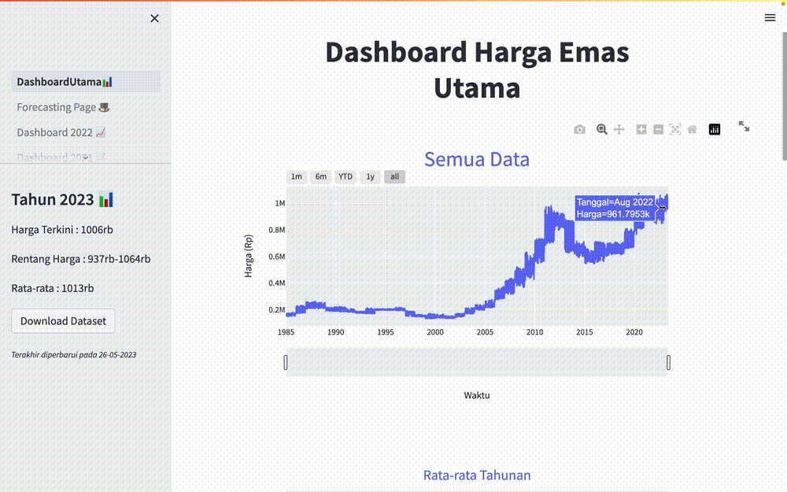

<h1 align="center">
Forecasting Application using LSTM for Gold Price
 
┄
</h1>
This application utilizes the Long Short-Term Memory (LSTM) method to forecast future gold prices. It provides information on the current gold price and estimates the future gold price. These predictions can assist gold traders in making informed investment decisions.

## Application Features

- Displays the current gold price
- Predicts future gold prices using the LSTM model
- Visualizes the prediction results with interactive plots using Plotly Express
- Evaluates the model using Mean Absolute Error (MAE), Mean Squared Error (MSE), and Root Mean Squared Error (RMSE)
- Allows selecting the prediction time range

## Preprocessing Data Steps

1. Missing Value Imputation using Forward Fill: If there are missing values in the gold price data, the last known value will be used to fill in the missing values.

2. Data Normalization using MinMaxScaler: The gold price data will be normalized using the Min-Max Scaling method to have values within the range [0, 1]. This normalization facilitates training and utilizing the LSTM model.

3. Splitting Data into Training and Testing Sets (90:10 ratio): The gold price data will be divided into two sets: a training set (90% of the total data) and a testing set (10% of the total data). The training set is used to train the LSTM model, while the testing set is used to evaluate the model's performance.

4. Windowing with a size of 500: The gold price data will be divided into windows of size 500. These windows will be used as inputs to train the LSTM model. The window size can be adjusted according to requirements.

## LSTM Model Structure

The LSTM model consists of two LSTM layers and one Fully Connected Layer (FCL). The LSTM layers capture long-term patterns in the gold price data, while the FCL layer performs the prediction of future gold prices.

## Utilizing Streamlit and Plotly Express

This application utilizes Streamlit as the user interface (UI). Streamlit enables users to interact with the application seamlessly. Plotly Express is used to create interactive plots that display actual and predicted gold price data.

## Model Evaluation

The model is evaluated using three metrics: Mean Absolute Error (MAE), Mean Squared Error (MSE), and Root Mean Squared Error (RMSE). These metrics provide information on how closely the model's predictions align with the actual values.

## Note

This application provides predictions based on historical gold price data and does not consider other factors that may influence gold prices. Users should be aware that gold price predictions can be influenced by various factors and should exercise caution when making investment decisions.

## Example App
You can visit the app at <a href="https://achmadbauravindah-forecasting-goldprice-1-dashboardutama-men1m5.streamlit.app/">link</a>
